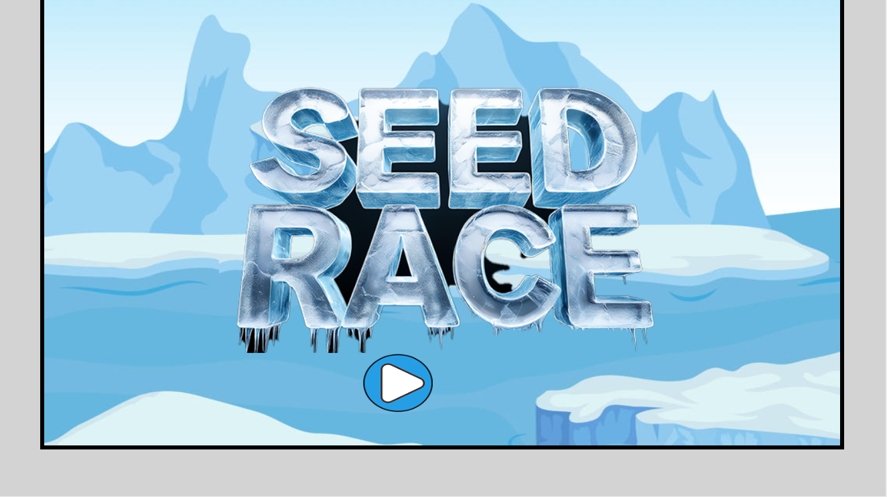
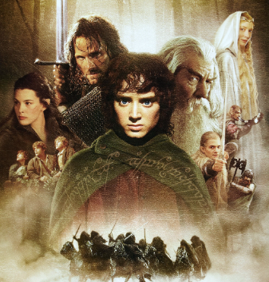

          I started in Tech fairly recently but have loved every step of the
          journey. It is the best thing to see the final product and know that
          all the work I have put through it has shown. Below is a collection of
          my projects starting from recently to when I first started at Dev
          Academy. With the first on the list is a game I worked on with my
          Group Calli2Welli from PowerUp Game Jam just in the last weekend!
          
      
      
        Seed Race
        Koia NZ did a PowerUp in conjunction with the USA embassy here in Wellington NZ did a Game Jam Event for Women which 
          was held over the weekend of the 28th of September to 1st of October 2024!  It was an awesome and hectic experience which has fuel my 
          already love for gaming codes and designs!

        
Languages used: Javascript, HTML

        
    
        <h4>Hot Cars List</h4>
        
This was one of my last self project assignment in Dev Academy.  I love cars especially street cars done up! 
          These are some of the cars I have on my bucket list and gal! I have a wide bucket!
        

        
Languages used:Javascript, Database, Full Stacks 

        

        <h4>Lord of The APIs</h4>
        
 This is one of the first group project using a Public API.  We all love the Lord of the Rings Trilogy and thought if we did an app where you can look up particular quotes of each movie. We had fun working together and this was one of the first time 
          showing us how much we learn from each other!
        

        
  Languages used: Javascript, Public APIs

        
      
    

  </body>
</html>
